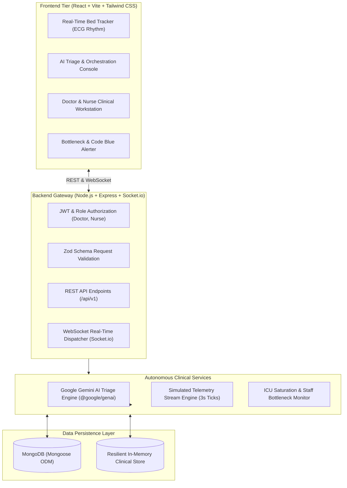

# 🏥 PulseOps | Real-Time Smart Hospital Automation & Patient Tracking Dashboard

An enterprise-grade, AI-powered clinical operations platform and real-time telemetry dashboard. PulseOps bridges acute patient physiological monitoring, automated Emergency Severity Index (ESI) triage using **Google Gemini 2.5 Flash**, dynamic bed allocation, and role-based staff clinical charting.

---

## 📑 Table of Contents
- [Architectural Overview](#-architectural-overview)
- [Core Features](#-core-features)
- [Technology Stack](#-technology-stack)
- [Repository Structure](#-repository-structure)
- [Security & Environment Isolation](#-security--environment-isolation)
- [Quick Start Guide](#-quick-start-guide)
- [Demo Staff Credentials](#-demo-staff-credentials)
- [API Endpoints Reference](#-api-endpoints-reference)
- [Production Deployment Execution](#-production-deployment-execution)

---

## 🏛 Architectural Overview



---

## 🌟 Core Features

### 1. Real-Time Patient & Bed Tracker Grid
- **Live Bed Matrix**: Visualizes active units across Intensive Care (ICU), Emergency (ER), Cardiology (CARD), and General Wards.
- **Simulated Real-Time Vital Telemetry**: Streams dynamic physiological readings every 3 seconds (Heart Rate, Blood Pressure, SpO2, Respiratory Rate, and Temperature).
- **Interactive ECG Waveforms**: Custom Canvas rhythm generator rendering sinus rhythm, tachycardia, and critical arrhythmias.
- **Immediate Visual Statusing**: Bed tiles change dynamically between *Occupied*, *Ready for Intake*, and *Sanitizing*.

### 2. Google Gemini AI Triage & Clinical Orchestration
- **Autonomous ESI Classification**: Ingests patient demographics, vital signs, and nurse clinical observations to compute Emergency Severity Index scores (ESI Level 1–5).
- **Physiological Threat Analysis**: Gemini explains immediate physiological threats (e.g., STEMI, Septic Shock, Status Asthmaticus).
- **Actionable Clinical Pathways**: Recommends prioritized emergency interventions and diagnostics (medications, imaging, lab orders).
- **Intelligent Staff Auto-Assignment**: Automatically routes high-acuity patients to available Attending Physicians or Critical Care Nurses with the lightest caseload.

### 3. Smart Resource Allocation & Bottleneck Alerter
- **ICU Saturation Alarms**: Automatically flags when Intensive Care Unit capacity hits or exceeds 75%.
- **Unassigned High-Priority Monitoring**: Alerts operations leads when ESI Level 1 or 2 patients lack an assigned physician.
- **Bedside Telemetry Breach Alarms**: Instant Code-Blue toast notifications when SpO2 drops below 90% or heart rate crosses tachycardia/bradycardia thresholds.

### 4. Secure Staff Clinical Portal
- **Role-Based Access Control (RBAC)**: Doctor and Nurse roles secured with JSON Web Tokens (JWT) and `bcrypt` password hashing.
- **Interactive Patient Charting**: Review vital signs history, add Doctor Orders, Nursing Assessments, and Progress Notes with real-time UI synchronization.
- **Clinical Task Checklist**: Auto-generated AI tasks and manual physician orders with one-click completion tracking.

---

## 💻 Technology Stack

| Layer | Technologies |
|---|---|
| **Frontend** | React 18+, Vite, React Router v6+, Tailwind CSS, Axios, Lucide React, Socket.io Client |
| **Backend** | Node.js, Express.js, Socket.io, Mongoose (MongoDB ODM), Dotenv, Cors |
| **AI Engine** | Google Gemini API (`@google/genai`) using `gemini-2.5-flash` with structured JSON output |
| **Security** | JSON Web Tokens (`jsonwebtoken`), Password Hashing (`bcryptjs`), Request Validation (`zod`) |
| **Architecture** | Clean monorepo (`/frontend` and `/backend`) with parallel launch scripts |

---

## 📂 Repository Structure

```
project1/
├── README.md                               # Project documentation & deployment manual
├── package.json                            # Monorepo root scripts (concurrent dev)
│
├── backend/                                # Node.js & Express API Server
│   ├── .env.example                        # Template environment variables
│   ├── .env                                # Local configuration & API keys
│   ├── server.js                           # Express application & Socket.io server
│   ├── config/
│   │   ├── db.js                           # Mongoose connection with resilient fallback
│   │   └── gemini.js                       # Google Gemini client initialization
│   ├── controllers/
│   │   ├── authController.js               # Staff registration, login, and profile
│   │   ├── patientController.js            # Admissions, vitals, and chart notes
│   │   ├── triageController.js             # AI triage evaluation & clinical tasks
│   │   ├── bedController.js                # Bed inventory, occupancy, and allocation
│   │   ├── taskController.js               # Clinical tasks assignment & completion
│   │   └── alertController.js              # Operational bottlenecks & alarms
│   ├── middleware/
│   │   ├── authMiddleware.js               # JWT bearer verification
│   │   ├── roleMiddleware.js               # Doctor vs Nurse role gating
│   │   ├── validateMiddleware.js           # Generic Zod schema request validation
│   │   └── errorHandler.js                 # Centralized error handler
│   ├── models/
│   │   ├── User.js                         # Staff schema (Doctor, Nurse, Admin)
│   │   ├── Patient.js                      # Patient demographics, vitals & chart notes
│   │   ├── Bed.js                          # Hospital bed inventory & ward unit
│   │   ├── TriageRecord.js                 # Gemini AI triage evaluations
│   │   ├── Task.js                         # Staff clinical orders & tasks
│   │   └── SystemAlert.js                  # Operational bottlenecks & alarms
│   ├── services/
│   │   ├── geminiService.js                # Structured prompt engineering & Gemini client
│   │   ├── vitalsSimulationService.js      # Realistic physiological vital streams
│   │   ├── resourceOptimizerService.js     # ICU capacity and doctor backlog monitor
│   │   ├── socketService.js                # Real-time WebSocket event broadcaster
│   │   └── memoryStore.js                  # Resilient zero-config data fallback
│   ├── validators/
│   │   ├── authValidators.js               # Zod validation for auth
│   │   ├── patientValidators.js            # Zod validation for patient & vitals
│   │   └── triageValidators.js             # Zod validation for triage intake
│   └── seed/
│       └── seedData.js                     # Hospital database seeder script
│
└── frontend/                               # React + Vite Frontend Client
    ├── index.html                          # Medical command center shell
    ├── vite.config.js                      # Vite proxy configuration
    ├── tailwind.config.js                  # Hospital telemetry color palette
    └── src/
        ├── App.jsx                         # Main router with protected layouts
        ├── main.jsx                        # React root entry point
        ├── index.css                       # Telemetry glowing badges and animations
        ├── context/
        │   ├── AuthContext.jsx             # JWT authentication & demo logins
        │   ├── SocketContext.jsx           # Socket.io connection manager
        │   └── HospitalContext.jsx         # Live telemetry & hospital state cache
        ├── components/
        │   ├── common/Navbar.jsx           # Header with real-time stream status
        │   ├── common/Sidebar.jsx          # Medical ops navigation
        │   ├── common/AlertToast.jsx       # Emergent Code Blue alert toast
        │   ├── dashboard/BedStatusCard.jsx # Live bed tile with vitals & ECG wave
        │   ├── dashboard/VitalsLiveWave.jsx# Canvas ECG rhythm waveform
        │   ├── dashboard/BottleneckBanner.jsx # Operational bottleneck banner
        │   ├── dashboard/MetricsOverview.jsx  # Real-time hospital KPI stats
        │   ├── staff/PatientChartModal.jsx    # Doctor/Nurse chart & order editor
        │   ├── staff/QuickVitalsModal.jsx     # Rapid bedside vitals updater
        │   └── beds/AssignPatientModal.jsx    # Bed intake allocation modal
        └── pages/
            ├── LoginPage.jsx               # Staff sign-in with 1-click demo logins
            ├── DashboardPage.jsx           # Main real-time tracker & bed grid
            ├── AITriagePage.jsx            # Gemini AI Triage intake workbench
            ├── BedManagementPage.jsx       # Ward capacity & inventory matrix
            └── StaffPortalPage.jsx         # My Assigned Patients & Task Board
```

---

## 🔒 Security & Environment Isolation

### Google Gemini API Key Isolation Policy
- **Zero Client Exposure**: The Gemini API key is **strictly stored in `backend/.env`** and accessed exclusively via `process.env.GEMINI_API_KEY`.
- The frontend client communicates solely with our authenticated backend proxy endpoint (`POST /api/triage/evaluate`), preventing API key extraction or client-side tampering.

### Backend `.env` Configuration
Create `backend/.env` using the provided template (`backend/.env.example`):

```ini
# Server Configuration
PORT=5000
NODE_ENV=development
CLIENT_URL=http://localhost:5173

# Database (Local MongoDB or MongoDB Atlas URI)
MONGODB_URI=mongodb://localhost:27017/smart_hospital

# Authentication & Security
JWT_SECRET=your_super_secret_jwt_key_here
JWT_EXPIRES_IN=7d

# Google Gemini API Key (Get free key at: https://aistudio.google.com/)
GEMINI_API_KEY=AIzaSy...your_gemini_api_key_here
```

> **Note on Zero-Configuration Execution**: If you do not have a local MongoDB daemon installed or running, the backend seamlessly activates its built-in in-memory clinical data store. All models, real-time vitals streams, AI evaluations, and chart updates function out of the box with zero setup.

---

## 🚀 Quick Start Guide

### Prerequisites
- **Node.js** (v18.0.0 or higher)
- **NPM** (v9.0.0 or higher)

### 1. Install All Dependencies
From the project root:
```bash
npm run install:all
```
*Or install individually:*
```bash
cd backend && npm install
cd ../frontend && npm install
```

### 2. Configure Environment Secrets
Ensure `backend/.env` exists with your Gemini API key (optional for heuristic testing, required for Gemini AI analysis):
```bash
cp backend/.env.example backend/.env
```

### 3. (Optional) Seed Initial Database
To seed MongoDB with initial hospital beds, doctors, and patients:
```bash
npm run seed
```

### 4. Launch Development Servers Concurrently
Start both backend (port 5000) and frontend (port 5173) in one terminal:
```bash
npm run dev
```

Open your browser to: **`http://localhost:5173`**

---

## 🩺 Demo Staff Credentials

For instant demonstration, the Login page provides **1-Click Quick Login** buttons:

| Role | Staff Member | Email | Password |
|---|---|---|---|
| **Doctor (ICU)** | Dr. Sarah Chen, MD | `dr.chen@hospital.org` | `password123` |
| **Doctor (ER)** | Dr. Marcus Vance, MD | `dr.vance@hospital.org` | `password123` |
| **Nurse (Triage)** | Elena Rostova, RN | `nurse.elena@hospital.org` | `password123` |
| **Nurse (ICU)** | James Miller, BSN | `nurse.james@hospital.org` | `password123` |

---

## 📡 API Endpoints Reference

### Authentication (`/api/auth`)
- `POST /api/auth/register` - Register a new staff member (Zod validated)
- `POST /api/auth/login` - Authenticate staff and return JWT bearer token
- `GET /api/auth/me` - Fetch authenticated user profile
- `GET /api/auth/staff` - Get clinical staff directory for task delegation

### Hospital Beds (`/api/beds`)
- `GET /api/beds` - Get all beds with current occupancy & patient telemetry
- `PATCH /api/beds/:id/assign` - Assign a patient to a bed
- `PATCH /api/beds/:id/release` - Release bed and trigger sanitization cycle
- `PATCH /api/beds/:id/status` - Update bed status (`available`, `cleaning`, `maintenance`)

### Patients & Telemetry (`/api/patients`)
- `GET /api/patients` - Query active patients (filter by status, acuity, ward)
- `GET /api/patients/:id` - Retrieve full clinical record and vitals timeline
- `POST /api/patients` - Admit a new patient and issue MRN
- `PATCH /api/patients/:id/vitals` - Manual vital sign update with real-time broadcast
- `POST /api/patients/:id/chart-notes` - Append physician order or nursing assessment

### AI Triage Engine (`/api/triage`)
- `POST /api/triage/evaluate` - Process patient logs via Google Gemini 2.5 Flash, generate ESI score, and auto-dispatch clinical tasks
- `GET /api/triage/history` - Retrieve historical triage audit log

### Operational Alarms (`/api/alerts`)
- `GET /api/alerts` - Query active capacity bottlenecks and critical alerts
- `PATCH /api/alerts/:id/resolve` - Acknowledge and resolve an alert
- `POST /api/alerts/audit` - Manually trigger hospital capacity bottleneck audit

---

## 🚢 Production Deployment Execution

### Option A: Containerized Docker Deployment
Create a `Dockerfile` for backend and a multi-stage `Dockerfile` for frontend with Nginx:

```bash
# Build & Run with Docker Compose
docker-compose up --build -d
```

### Option B: Cloud Run / VPS Deployment
1. **Backend**:
   - Set environment variables: `NODE_ENV=production`, `PORT=8080`, `MONGODB_URI`, `JWT_SECRET`, `GEMINI_API_KEY`, `CLIENT_URL=https://your-domain.com`.
   - Run `npm start` behind a reverse proxy (Nginx or Cloud Load Balancer) with SSL/TLS termination.
2. **Frontend**:
   - Build production assets: `cd frontend && npm run build`.
   - Serve the resulting `/frontend/dist` directory using Nginx, Cloudflare Pages, or AWS S3/CloudFront with standard SPA fallback rules.

---

## 🛡 License & Compliance
This software is developed for clinical workflow optimization and healthcare automation demonstrations. Built in accordance with healthcare data protection principles and emergency medicine triage protocols (ESI 5-Level Algorithm).
